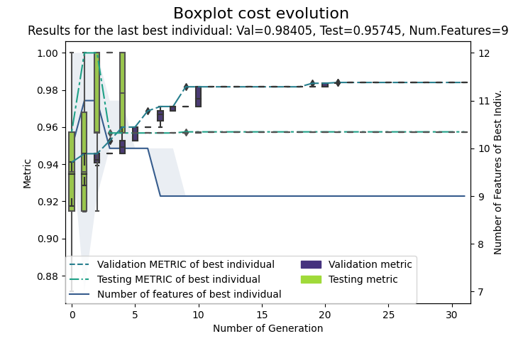
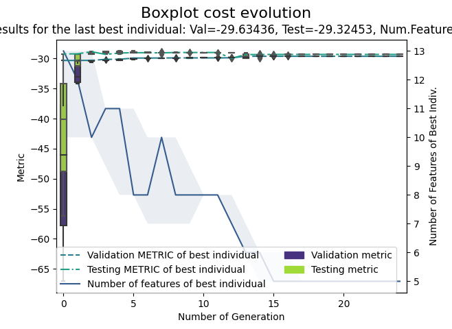

# GAparsimony

[](https://sonarcloud.io/dashboard?id=GAparsimony)
[](https://sonarcloud.io/dashboard?id=GAparsimony)
[](https://sonarcloud.io/dashboard?id=GAparsimony)
[](https://gaparsimony.readthedocs.io/en/latest/?badge=latest)

GAparsimony
===========

GAparsimony for Python is a package for searching with genetic algorithms (GA) 
accurate parsimonious models by combining feature selection (FS), model
hyperparameter optimization (HO), and parsimonious model selection
(PMS). It has R implementation [R GAparsimony](https://github.com/jpison/GAparsimony)

PMS is based on separate cost and complexity evaluations. The best
individuals are initially sorted by an error fitness function, and
afterwards, models with similar costs are rearranged according to model
complexity measurement so as to foster models of lesser complexity. The
algorithm can be run sequentially or in parallel.

Installation
------------

Install these packages:

``` {.bash}
pip install GAparsimony
```


How to use this package
-----------------------

### Example 1: Classification

This example shows how to search, for the *Sonar* database, a parsimony
SVM classificator with **GAparsimony** package.

In the next step, a fitness function is created using getFitness. This function return a fitness function for the `SVC` model, the `cohen_kappa_score` metric and the predefined `svm` complexity function for SVC models. We set regression to `False` beacause is classification example.

A SVM model is trained with these parameters and the selected input
features. Finally, *fitness()* returns a vector with three values:
the *kappa* statistic obtained with the mean of 10 runs of a 10-fold
cross-validation process, the *kappa* measured with the test database to
check the model generalization capability, and the model complexity. And the trained model.

The GA-PARSIMONY process begins defining the range of the SVM parameters
and their names. Also, *rerank\_error* can be tuned with different
*ga\_parsimony* runs to improve the **model generalization capability**.
In this example, *rerank\_error* has been fixed to 0.001 but other
values could improve the trade-off between model complexity and model
accuracy. For example, with *rerank\_error=0.01*, we can be interested 
in obtaining models with a smaller number of inputs with a *gamma* rounded
to two decimals.

``` {.Python}
import pandas as pd
from sklearn.model_selection import RepeatedKFold
from sklearn.svm import SVC
from sklearn.metrics import cohen_kappa_score

from GAparsimony import GAparsimony, Population, getFitness
from GAparsimony.util import svm

df = pd.read_csv("./data/sonar_csv.csv")

rerank_error = 0.001
params = {"C":{"range": (00.0001, 99.9999), "type": Population.FLOAT}, 
          "gamma":{"range": (0.00001,0.99999), "type": Population.FLOAT}, 
          "kernel": {"value": "poly", "type": Population.CONSTANT}}

fitness = getFitness(SVC, cohen_kappa_score, svm, regression=False, test_size=0.2, random_state=42, n_jobs=-1)


GAparsimony_model = GAparsimony(fitness=fitness,
                                  params=params,
                                  features=len(df.columns[:-1]),
                                  keep_history = True,
                                  rerank_error = rerank_error,
                                  popSize = 40,
                                  maxiter = 5, early_stop=3,
                                  feat_thres=0.90, # Perc selected features in first generation
                                  feat_mut_thres=0.10, # Prob of a feature to be one in mutation
                                  seed_ini = 1234)
```

With small databases, it is highly recommended to execute
**GAparsimony** with different seeds in order to find
the most important input features and model parameters.

In this example, one GA optimization is presented with a training database 
composed of 60 input features and 167 instances, and a test database with only 41 instances.
Hence, a robust validation metric is necessary. Thus, a repeated cross-validation is performed.

Starts the GA optimizaton process with 40 individuals per generation and
a maximum number of 5 iterations with an early stopping when
validation measure does not increase significantly in 3 generations.
Parallel is activated. In addition, history of each iteration is saved
in order to use *plot* and *parsimony\_importance* methods.

``` {.python}
GAparsimony_model.fit(df.iloc[:, :-1], df.iloc[:, -1])
```
```
#output

GA-PARSIMONY | iter = 0
  MeanVal = 0.5843052  |  ValBest = 0.6566379  |  TstBest = 0.5714286  |ComplexBest = 52000000083.0| Time(min) = 0.2102916  

GA-PARSIMONY | iter = 1
  MeanVal = 0.6170463  |  ValBest = 0.6830278  |  TstBest = 0.5714286  |ComplexBest = 49000000078.0| Time(min) = 0.1410736  

GA-PARSIMONY | iter = 2
  MeanVal = 0.5988507  |  ValBest = 0.6960123  |   TstBest = 0.529148  |ComplexBest = 46000000088.0| Time(min) = 0.1321333  

GA-PARSIMONY | iter = 3
  MeanVal = 0.6489272  |  ValBest = 0.6972242  |  TstBest = 0.7042254  |ComplexBest = 44000000067.0| Time(min) = 0.1457411  

GA-PARSIMONY | iter = 4
  MeanVal = 0.6375668  |  ValBest = 0.6987458  |  TstBest = 0.5714286  |ComplexBest = 41000000080.0| Time(min) = 0.1268976  
```

summary() shows the GA initial settings and two solutions: the solution with the best validation score in the whole GA optimization process, and finally, the best parsimonious individual at the last generation.

``` {.python}
GAparsimony_model.summary()
```
``` 
+------------------------------------+
|             GA-PARSIMONY           |
+------------------------------------+

GA-PARSIMONY settings:
 Number of Parameters      = 2
 Number of Features        = 60
 Population size           = 40
 Maximum of generations    = 5
 Number of early-stop gen. = 10
 Elitism                   = 8
 Crossover probability     = 0.8
 Mutation probability      = 0.1
 Max diff(error) to ReRank = 0.001
 Perc. of 1s in first popu.= 0.9
 Prob. to be 1 in mutation = 0.1

 Search domain =
                 C    gamma  col_0  col_1  col_2  col_3  col_4  col_5  col_6  \
Min_param   0.0001  0.00001    0.0    0.0    0.0    0.0    0.0    0.0    0.0
Max_param  99.9999  0.99999    1.0    1.0    1.0    1.0    1.0    1.0    1.0

           col_7  col_8  col_9  col_10  col_11  col_12  col_13  col_14  \
Min_param    0.0    0.0    0.0     0.0     0.0     0.0     0.0     0.0
Max_param    1.0    1.0    1.0     1.0     1.0     1.0     1.0     1.0

           col_15  col_16  col_17  col_18  col_19  col_20  col_21  col_22  \
Min_param     0.0     0.0     0.0     0.0     0.0     0.0     0.0     0.0
Max_param     1.0     1.0     1.0     1.0     1.0     1.0     1.0     1.0

           col_23  col_24  col_25  col_26  col_27  col_28  col_29  col_30  \
Min_param     0.0     0.0     0.0     0.0     0.0     0.0     0.0     0.0
Max_param     1.0     1.0     1.0     1.0     1.0     1.0     1.0     1.0

           col_31  col_32  col_33  col_34  col_35  col_36  col_37  col_38  \
Min_param     0.0     0.0     0.0     0.0     0.0     0.0     0.0     0.0
Max_param     1.0     1.0     1.0     1.0     1.0     1.0     1.0     1.0

           col_39  col_40  col_41  col_42  col_43  col_44  col_45  col_46  \
Min_param     0.0     0.0     0.0     0.0     0.0     0.0     0.0     0.0
Max_param     1.0     1.0     1.0     1.0     1.0     1.0     1.0     1.0

           col_47  col_48  col_49  col_50  col_51  col_52  col_53  col_54  \
Min_param     0.0     0.0     0.0     0.0     0.0     0.0     0.0     0.0
Max_param     1.0     1.0     1.0     1.0     1.0     1.0     1.0     1.0

           col_55  col_56  col_57  col_58  col_59
Min_param     0.0     0.0     0.0     0.0     0.0
Max_param     1.0     1.0     1.0     1.0     1.0


GA-PARSIMONY results:
 Iterations                = 5
 Best validation score = 0.6987458064875495


Solution with the best validation score in the whole GA process =

  fitnessVal fitnessTst complexity        C     gamma col_0 col_1 col_2 col_3  \
0   0.698746   0.571429    4.1e+10  36.6934  0.130766     0     1     1     1

  col_4 col_5 col_6 col_7 col_8 col_9 col_10 col_11 col_12 col_13 col_14  \
0     1     1     1     1     1     1      1      0      0      0      1

  col_15 col_16 col_17 col_18 col_19 col_20 col_21 col_22 col_23 col_24  \
0      1      1      1      0      0      1      0      1      1      1

  col_25 col_26 col_27 col_28 col_29 col_30 col_31 col_32 col_33 col_34  \
0      1      1      0      1      1      1      1      0      1      1

  col_35 col_36 col_37 col_38 col_39 col_40 col_41 col_42 col_43 col_44  \
0      1      1      1      0      0      1      0      0      1      0

  col_45 col_46 col_47 col_48 col_49 col_50 col_51 col_52 col_53 col_54  \
0      1      0      0      1      1      1      1      0      1      1

  col_55 col_56 col_57 col_58 col_59
0      0      0      1      1      1


Results of the best individual at the last generation =

 Best indiv's validat.cost = 0.6987458064875495
 Best indiv's testing cost = 0.5714285714285714
 Best indiv's complexity   = 41000000080.0
 Elapsed time in minutes   = 0.7561371922492981


BEST SOLUTION =

  fitnessVal fitnessTst complexity        C     gamma col_0 col_1 col_2 col_3  \
0   0.698746   0.571429    4.1e+10  36.6934  0.130766     0     1     1     1

  col_4 col_5 col_6 col_7 col_8 col_9 col_10 col_11 col_12 col_13 col_14  \
0     1     1     1     1     1     1      1      0      0      0      1

  col_15 col_16 col_17 col_18 col_19 col_20 col_21 col_22 col_23 col_24  \
0      1      1      1      0      0      1      0      1      1      1

  col_25 col_26 col_27 col_28 col_29 col_30 col_31 col_32 col_33 col_34  \
0      1      1      0      1      1      1      1      0      1      1

  col_35 col_36 col_37 col_38 col_39 col_40 col_41 col_42 col_43 col_44  \
0      1      1      1      0      0      1      0      0      1      0

  col_45 col_46 col_47 col_48 col_49 col_50 col_51 col_52 col_53 col_54  \
0      1      0      0      1      1      1      1      0      1      1

  col_55 col_56 col_57 col_58 col_59
0      0      0      1      1      1
```

Plot GA evolution.

``` {.python}
GAparsimony_model.plot()
```


GA-PARSIMONY evolution

Show percentage of appearance for each feature in elitists

``` {.python}
# Percentage of appearance for each feature in elitists
GAparsimony_model.importance()
```
```
+--------------------------------------------+
|                  GA-PARSIMONY              |
+--------------------------------------------+

Percentage of appearance of each feature in elitists:

  col_1 col_15 col_2 col_51 col_57 col_58 col_29 col_59 col_30  col_31  \
0   100    100   100    100    100    100    100    100    100  96.875

    col_9  col_40  col_20  col_26  col_53 col_14 col_16 col_36  col_4 col_10  \
0  96.875  96.875  96.875  96.875  96.875  93.75  93.75  93.75  93.75  93.75

  col_45 col_50   col_7  col_32  col_34   col_8  col_17 col_22 col_41 col_56  \
0  93.75  93.75  90.625  90.625  90.625  90.625  90.625   87.5   87.5   87.5

   col_23  col_54  col_6  col_48  col_43  col_12  col_55 col_38 col_37 col_49  \
0  84.375  84.375  81.25  78.125  78.125  78.125  78.125     75     75     75

    col_0  col_11  col_28 col_35 col_25  col_24  col_33   col_5  col_27  \
0  71.875  71.875  71.875  68.75  68.75  65.625  65.625  65.625  59.375

   col_52   col_3  col_18  col_47  col_39 col_19 col_46 col_21  col_42 col_13  \
0  59.375  53.125  40.625  40.625  34.375  31.25  31.25  31.25  28.125     25

   col_44
0  21.875
```

### Example 2: Regression

This example shows how to search, for the *Boston* database, a parsimonious
ANN model for regression and with **GAparsimony** package.

In the next step, a fitness function is created using getFitness. This function return a fitness function for the `Lasso` model, the `mean_squared_error`(RMSE) metric and the predefined `linearModels` complexity function for SVC models. We set regression to `True` beacause is classification example.

A Lasso model is trained with these parameters and the selected input
features. Finally, *fitness()* returns a vector with three negatives values:
the *RMSE* statistic obtained with the mean of 10 runs of a 10-fold
cross-validation process, the *RMSE* measured with the test database to
check the model generalization capability, and the model complexity. And the trained model.

The GA-PARSIMONY process begins defining the range of the SVM parameters
and their names. Also, *rerank\_error* can be tuned with different
*ga\_parsimony* runs to improve the **model generalization capability**.
In this example, *rerank\_error* has been fixed to 0.01 but other
values could improve the trade-off between model complexity and model
accuracy.

Therefore, PMS considers the most parsimonious model with the lower
number of features. Between two models with the same number of features,
the lower sum of the squared network weights will determine the most
parsimonious model (smaller weights reduce the propagation of disturbances).


``` {.python}
from sklearn.model_selection import RepeatedKFold
from sklearn.linear_model import Lasso
from sklearn.preprocessing import StandardScaler
from sklearn.metrics import mean_squared_error

from sklearn.datasets import load_boston

from GAparsimony import GAparsimony, Population, getFitness
from GAparsimony.util import linearModels

boston = load_boston()
X, y = boston.data, boston.target 
X = StandardScaler().fit_transform(X)

# ga_parsimony can be executed with a different set of 'rerank_error' values
rerank_error = 0.01

params = {"alpha":{"range": (1., 25.9), "type": Population.FLOAT}, 
            "tol":{"range": (0.0001,0.9999), "type": Population.FLOAT}}

fitness = getFitness(Lasso, mean_squared_error, linearModels, regression=True, test_size=0.2, random_state=42, n_jobs=-1)


GAparsimony_model = GAparsimony(fitness=fitness,
                                params = params, 
                                features = boston.feature_names,
                                keep_history = True,
                                rerank_error = rerank_error,
                                popSize = 40,
                                maxiter = 5, early_stop=3,
                                feat_thres=0.90, # Perc selected features in first generation
                                feat_mut_thres=0.10, # Prob of a feature to be one in mutation
                                seed_ini = 1234)
```
``` {.python}
GAparsimony_model.fit(X, y)
```
```
#output

GA-PARSIMONY | iter = 0
 MeanVal = -79.1813338 | ValBest = -30.3470614 | TstBest = -29.2466835 |ComplexBest = 13000000021.927263| Time(min) = 0.1210119  

GA-PARSIMONY | iter = 1
 MeanVal = -55.0713465 | ValBest = -30.2283235 | TstBest = -29.2267507 |ComplexBest = 12000000022.088743| Time(min) = 0.0713775  

GA-PARSIMONY | iter = 2
 MeanVal = -34.8473723 | ValBest = -30.2283235 | TstBest = -29.2267507 |ComplexBest = 12000000022.088743| Time(min) = 0.0631771  

GA-PARSIMONY | iter = 3
 MeanVal = -38.5251529 | ValBest = -30.0455259 | TstBest = -29.2712578 |ComplexBest = 10000000022.752678| Time(min) = 0.0586402  

GA-PARSIMONY | iter = 4
 MeanVal = -38.1097172 | ValBest = -29.8640867 | TstBest = -29.1833224 |ComplexBest = 8000000022.721948| Time(min) = 0.0682137 
```

summary() shows the GA initial settings and two solutions: the solution with the best validation score in the whole GA optimization process, and finally, the best parsimonious individual at the last generation.

``` {.python}
GAparsimony_model.summary()
```
``` 
+------------------------------------+
|             GA-PARSIMONY           |
+------------------------------------+

GA-PARSIMONY settings:
 Number of Parameters      = 2
 Number of Features        = 13
 Population size           = 40
 Maximum of generations    = 5
 Number of early-stop gen. = 3
 Elitism                   = 8
 Crossover probability     = 0.8
 Mutation probability      = 0.1
 Max diff(error) to ReRank = 0.01
 Perc. of 1s in first popu.= 0.9
 Prob. to be 1 in mutation = 0.1

 Search domain =
           alpha     tol  CRIM   ZN  INDUS  CHAS  NOX   RM  AGE  DIS  RAD  \
Min_param    1.0  0.0001   0.0  0.0    0.0   0.0  0.0  0.0  0.0  0.0  0.0
Max_param   25.9  0.9999   1.0  1.0    1.0   1.0  1.0  1.0  1.0  1.0  1.0

           TAX  PTRATIO    B  LSTAT
Min_param  0.0      0.0  0.0    0.0
Max_param  1.0      1.0  1.0    1.0


GA-PARSIMONY results:
 Iterations                = 5
 Best validation score = -29.864086737831904


Solution with the best validation score in the whole GA process =

  fitnessVal fitnessTst complexity    alpha       tol CRIM ZN INDUS CHAS NOX  \
0   -29.8641   -29.1833      8e+09  1.33745  0.340915    1  0     1    0   1

  RM AGE DIS RAD TAX PTRATIO  B LSTAT
0  1   0   1   0   0       1  1     1


Results of the best individual at the last generation =

 Best indiv's validat.cost = -29.864086737831904
 Best indiv's testing cost = -29.183322365179112
 Best indiv's complexity   = 8000000022.721948
 Elapsed time in minutes   = 0.3824204007784525


BEST SOLUTION =

  fitnessVal fitnessTst complexity    alpha       tol CRIM ZN INDUS CHAS NOX  \
0   -29.8641   -29.1833      8e+09  1.33745  0.340915    1  0     1    0   1

  RM AGE DIS RAD TAX PTRATIO  B LSTAT
0  1   0   1   0   0       1  1     1
```

Plot GA evolution.

``` {.python}
GAparsimony_model.plot()
```


GA-PARSIMONY evolution

Show percentage of appearance for each feature in elitists

``` {.python}
# Percentage of appearance for each feature in elitists
GAparsimony_model.importance()
```
```
+--------------------------------------------+
|                  GA-PARSIMONY              |
+--------------------------------------------+

Percentage of appearance of each feature in elitists:

  PTRATIO LSTAT   RM    B     DIS    CRIM      ZN     NOX   INDUS    AGE  \
0     100   100  100  100  96.875  84.375  84.375  84.375  84.375  81.25

      TAX   CHAS RAD
0  71.875  56.25  50
```


References
----------
Martinez-De-Pison, F.J., Gonzalez-Sendino, R., Ferreiro, J., Fraile, E., Pernia-Espinoza, A. GAparsimony: An R package for searching parsimonious models by combining hyperparameter optimization and feature selection (2018) Lecture Notes in Computer Science (including subseries Lecture Notes in Artificial Intelligence and Lecture Notes in Bioinformatics), 10870 LNAI, pp. 62-73. [https://doi.org/10.1007/978-3-319-92639-1_6](https://doi.org/10.1007/978-3-319-92639-1_6)

Martinez-de-Pison, F.J., Gonzalez-Sendino, R., Aldama, A., Ferreiro-Cabello, J., Fraile-Garcia, E.
Hybrid methodology based on Bayesian optimization and GA-PARSIMONY to search for parsimony models by combining hyperparameter optimization and feature selection (2019) Neurocomputing, 354, pp. 20-26. [https://doi.org/10.1016/j.neucom.2018.05.136](https://doi.org/10.1016/j.neucom.2018.05.136)

Urraca R., Sodupe-Ortega E., Antonanzas E., Antonanzas-Torres F., Martinez-de-Pison, F.J. (2017). Evaluation of a novel GA-based
methodology for model structure selection: The GA-PARSIMONY. Neurocomputing, Online July 2017. [https://doi.org/10.1016/j.neucom.2016.08.154](https://doi.org/10.1016/j.neucom.2016.08.154)

Sanz-Garcia, A., Fernandez-Ceniceros, J., Antonanzas-Torres, F., Pernia-Espinoza, A.V., Martinez-De-Pison, F.J. GA-PARSIMONY: A GA-SVR approach with feature selection and parameter optimization to obtain parsimonious solutions for predicting temperature settings in a continuous annealing furnace (2015) Applied Soft Computing Journal, 35, art. no. 3006, pp. 13-28. [https://doi.org/10.1016/j.asoc.2015.06.012](https://doi.org/10.1016/j.asoc.2015.06.012)

Fernandez-Ceniceros, J., Sanz-Garcia, A., Antoñanzas-Torres, F., Martinez-de-Pison, F.J. A numerical-informational approach for characterising the ductile behaviour of the T-stub component. Part 2: Parsimonious soft-computing-based metamodel
(2015) Engineering Structures, 82, pp. 249-260. [https://doi.org/10.1016/j.engstruct.2014.06.047](https://doi.org/10.1016/j.engstruct.2014.06.047)

Antonanzas-Torres, F., Urraca, R., Antonanzas, J., Fernandez-Ceniceros, J., Martinez-De-Pison, F.J. Generation of daily global solar irradiation with support vector machines for regression (2015) Energy Conversion and Management, 96, pp. 277-286. [https://doi.org/10.1016/j.enconman.2015.02.086](https://doi.org/10.1016/j.enconman.2015.02.086)

